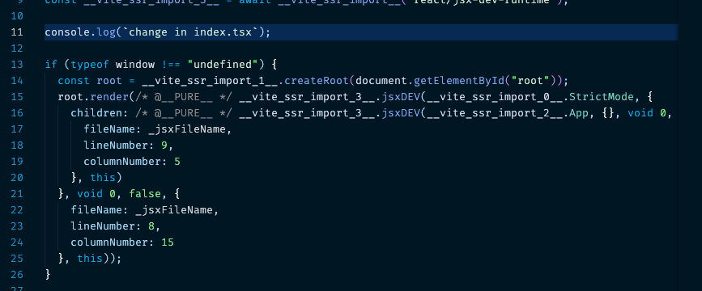
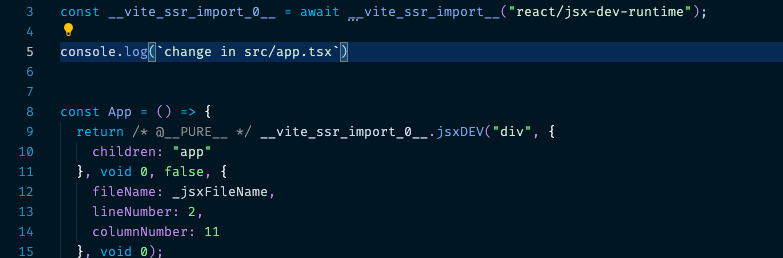
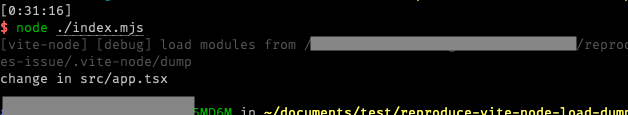

## Steps to Reproduce

1. `git clone git@github.com:await-ovo/reproduce-vite-node-load-dumpped-modules-issue.git`
2. `cd reproduce-vite-node-load-dumpped-modules-issue`
3. `pnpm install`
4. `node ./index.mjs`
5. modify dumpped code in `.vite-node/dump/_@fs_xxxxx_reproduce-vite-node-load-dumpped-modules-issue_src_index_tsx--xxxxx.js`:

6. modify dumpped code in `.vite-node/dump/_src_App_tsx--xxxx.js`:

7. `node ./index.mjs` then you can see that only the change of `.vite-node/dump/_src_App_tsx--xxxx.js` take effect:

